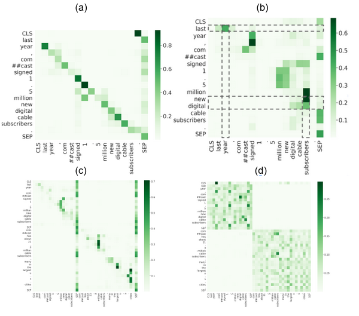

## Introduction
A novel way of labelling the attention heads of BERT as described in detail in the following paper: https://arxiv.org/abs/2101.09115. This contains the code for the same. There are 4 high-level functional roles: (a) Local, (b) Syntactic, (c) Block and (d) Delimiter.

The end-to-end process consists of the following steps:-
1. Compute sieve bias score from the attention weights.
2. Apply Hypothesis Testing on top of the scores to assign functional roles to the heads. 

## Setup (from scratch)
1. After cloning this repo, download the attention weights from [here] (https://drive.google.com/drive/folders/1tI3acAz4Qnlc9KBt9V6WEarMB5WUvw24?usp=sharing) and make a directory in the current folder named `pkl_dir` and keep all the attention weights files inside it.
