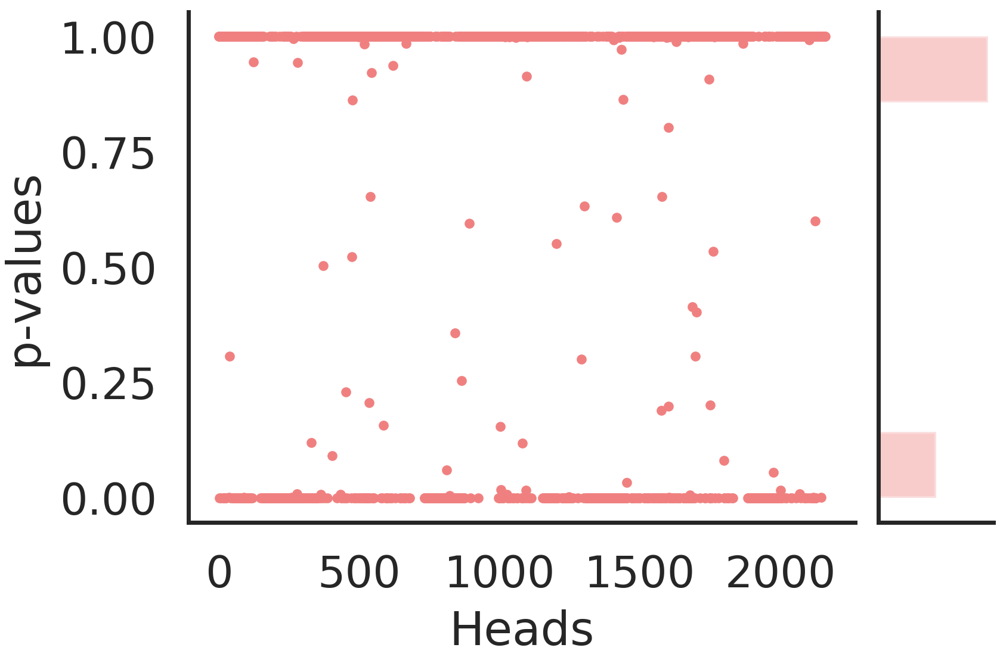

## Introduction
A novel way of labelling the attention heads of BERT as described in detail in the following paper: https://arxiv.org/abs/2101.09115. There are 4 high-level functional roles: (a) Local, (b) Syntactic, (c) Block and (d) Delimiter.

We test this approach for 4 GLUE tasks, namely: <em>QNLI, QQP, MRPC and SST-2</em>. The end-to-end process consists of the following steps:-
1. Compute sieve bias score from the attention weights.
2. Apply Hypothesis Testing on top of the scores to assign functional roles to the heads. 

## Setup (from scratch)
1. After cloning this repo, download the attention weights from [here](https://drive.google.com/drive/folders/1tI3acAz4Qnlc9KBt9V6WEarMB5WUvw24?usp=sharing) and make a directory in the current folder named `pkl_dir` and keep all the attention weights files inside it.
2. Run the respective ipynb files to compute the sieve scores for various functional roles.
3. A new folder named `sieve_scores` is created and the scores (for each input sequence and each functional role) are generated and saved in this folder.

## Setup (Quickstart)
1. For quick startup, we provide sample sieve scores (generated for 20 sentences taken from the test sets) [here](https://drive.google.com/drive/folders/1i4G_qg9nIwsh-NVmNyrtXlRBIiNeYrws?usp=sharing).
2. Download the scores and keep them inside a directory named `sieve_scores` in the current folder where this repository is cloned.
3. Run label_heads.ipynb that generates `<task_name>_gems.pkl` that can be fed into the plotting code to visualize the role assignments to heads. label_heads.ipynb also contains a quick visualization inline.

## Results
We derive several new observations and reinforce few other observations already present in the literature. This is by far the first attempt to bring statistical rigour while analyzing heads behaviour. Few of our key insights are:
* Heads can be multi-functional, ie., a single head can perform multiple roles, for example, many (42%-88%) heads are both local and syntactic across all the GLUE tasks.
* Most multi-funtional heads are present in the middle layers.
* Heads attending to SEP are present in the later layers, while those attending to the CLS token are present in the initial layers.
* As part of the task-specific fine-tuning, the later layers change the most with the high attention to the SEP token getting distributed to the other tokens of the sentence.
* We scatter the p-values we get in our analysis, since they denote the confidence of our role assignment. Most (around 98%) values are near 0 or 1 indicating that the heads were highly confident when evaluating the null hypothesis.

